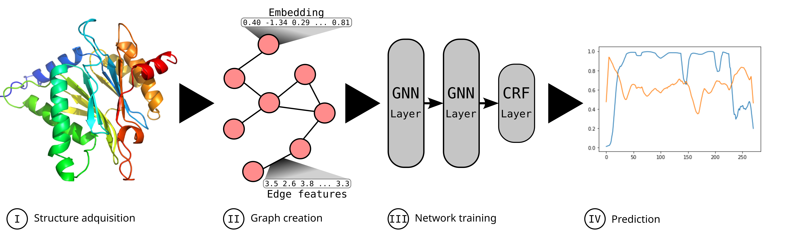

# Graph neural networks for Pfam domain annotation

Below you can find the instructions to produce the datafiles needed to train and test the model GNN2Pfam.
To setup the right enviroment you can use the file *Requirements.yaml* provided in this repository


## Getting the data
The required files to train and test the model described in *[paper]* are stored in *[path to drive]* along with the output obtained by the authors. The basic only needed to follow the pipeline is *MicroDataset.csv*. 



## I. Structure adquisition
### Download Alphafold structures
To get the AlphaFold structures we can run the script structureRetriever.py as:

```bash
python structureRetriever.py
```
This will create a new directory in ../data to store the AlphaFold PDBs for each protein in the dataset. 

## II. Graph creation
The construction of the graphs from the PDB files is done by the script *processPDB.py* by running

```bash
python processPDB.py
```

This script generates several new directories with each part of the graph:

1. Adjacency tables
2. Edge attributes
3. Nodes
4. Nodes features

Take into account that this is step takes quite a long time and generates a big volume of data (~*[NGb]*)


Once al the constitutent parts are calculated we can merge them into the graphs that are going to be used as the proteins representations using *mergeData.py*

```bash
python mergeData.py
```
Again, this takes time and disk space, but once this is done we can delete the previos calculated partes as we are going to use the graphs from now on.


## III. Network training
### 1. Model
### 2. Train

## IV. Prediction
### Test
